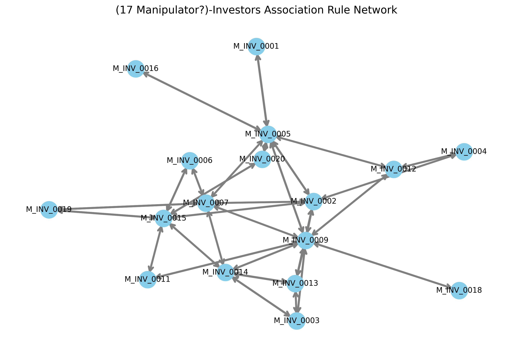

# Econ-Finance, Market Surveillance Projects Repo

## Projects

- **stock-manipulation-detection - Manipulators Association Rules Mining:** This project analyzes trading activity in financial markets to identify patterns of coordinated behavior between investors (manipulators) using **association rules mining**.
- **gold-price:** GLD-ETF Options-Based Gold Price Projection.
GLD Options-Based Gold Price Projection
- **accounting-fraud-detection:** simple python scripts for testing ML models for accounting fraud detection.

---

## Network Visualization

---

## Requirements

- Python 3.11+
- Libraries:
  - `pandas`
  - `mlxtend`
  - `networkx`
  - `matplotlib`
  - `pyvis` (for interactive visualization, optional)

