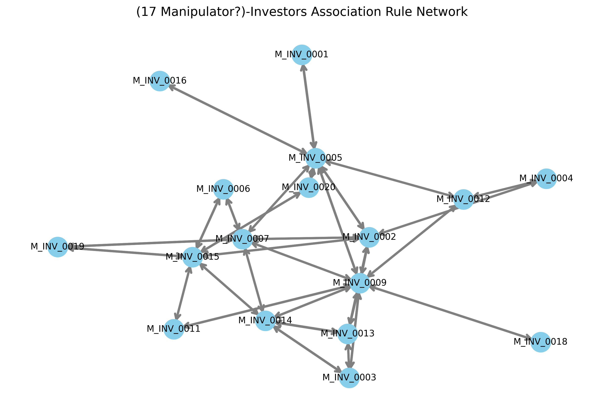

# Manipulators Association Rules Mining

This project analyzes trading activity in financial markets to identify patterns of coordinated behavior between investors (manipulators) using **association rules mining**.

---

## Overview

- Generates random trade data for rules mining
- Load trade data from a CSV file containing:
  - `buyer_id`, `seller_id`, `symbol`, `price`, `quantity`, `date_time`
- Group trades into **minute-level market baskets** containing all unique investors who traded in that minute.
- Apply **FP-Growth** to find frequent investor sets.
- Generate **association rules** with configurable minimum support and confidence thresholds.
- Visualize the relationships between investors as a **network graph**.

## Network Visualization

---

## Further Ideas for stock market manipulator detection

The trade dataset is segmented into chunks of approximately 150–200 transactions. Each chunk is then represented as a directed graph, where nodes correspond to market participants and edges capture the flow of trades from sellers to buyers. By applying community detection algorithms on these graphs, groups of tightly connected traders—akin to “market baskets”—are identified. Subsequently, association rule mining is employed within and across these communities to uncover recurring trading patterns. This layered approach provides a way to detect potentially manipulative behavior by revealing abnormal or coordinated transaction structures in the market.

These directed graphs can also be subjected to further graph-analytic techniques, such as identifying recurring "motifs", determining hubs and authorities within the trading network, and characterizing structural properties of trader interactions.

## Requirements

- Python 3.11+
- Libraries:
  - `pandas`
  - `mlxtend`
  - `networkx`

